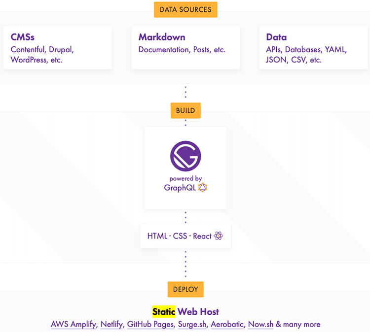

#GatbyJS의 특징

Gatsby는 CMS(content management system) 플랫폼 중에 하나로 HTMl, CSS, JavaScript로만 이루어진 페이지를 만들수 있게 해주는 정적 사이트 생성기(Static Site Generator) 이다. Gatsby는 웹페이지를 생성하기 위해 react와 graphql을 사용한다. 각 게시글은 Markdown으로 작성하며 이를 빌드하여 HTML파일로 바꿔준다.



위 그림을 보면 이해가 쉽게 될것이다. build과정에서 react와 graphql을 사용하여 정적 페이지를 만들어낸다.

#GatsbyJS를 선택한 이유

사실 어떤 플랫폼을 선택하여도 큰차이는 없을거라 생각하지만 스터디에서 사용하는 스택과 가장 일치하는 플랫폼을 선택하는 것이 스터디에도 도움이 되고 가장 편하지 않을까 라고 생각하여 Gatsby를 선택하게 되었다.

#GatbyJS로 개인블로그 생성하기

```bash
yarn global add gatsby-cli 
gatsby new DamoBlog https://github.com/GatsbyCentral/gatsby-v2-starter-lumen
```

- Gatsby Cli를 설치
- 프로젝트 생성, 원하는 테마가 있다면 마지막 옵션으로 저장소의 url을 주면된다, 본 블로그는 lumen v2 starter 를 사용하였다.

```bash
└── src
    ├── assets
    │   ├── fonts
    │   │   └── fontello-771c82e0
    │   │       ├── css
    │   │       └── font
    │   └── scss
    │       ├── base
    │       ├── mixins
    │       └── pages
    ├── components
    │   ├── CategoryTemplateDetails
    │   ├── Disqus
    │   ├── Links
    │   ├── Menu
    │   ├── PageTemplateDetails
    │   ├── Post
    │   ├── PostTemplateDetails
    │   ├── Sidebar
    │   └── TagTemplateDetails
    ├── layouts
    ├── pages
    │   ├── articles
    │   │   ├── 2016-01-09---Perfecting-the-Art-of-Perfection
    │   │   ├── 2016-01-12---The-Origins-of-Social-Stationery-Lettering
    │   │   ├── 2016-02-02---A-Brief-History-of-Typography
    │   │   ├── 2017-18-08---The-Birth-of-Movable-Type
    │   │   └── 2017-19-08---Humane-Typography-in-the-Digital-Age
    │   └── pages
    │       ├── 2015-05-01---about
    │       └── 2015-05-01---contact
    └── templates
```

- gatsby-v2-starter-lumen의 디렉토리 구조, 어떤 starter를 사용하든 비슷한 구조일테지만 lumen v2의 경우 /src/pages/articles에 md파일을 저장한다.

```bash
gatsby develop --host 0.0.0.0
```

- develop옵션으로 개발옵션으로 블로그를 서버에 올릴수 있다. host를 0.0.0.0으로 주지 않으면 localhost에만 바인딩 된다.