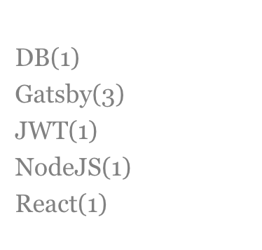

## Gatsby는 데이터를 graphql로 다룬다

gatsby를 develop모드로 실행을 하면 hostname/__graphql 으로 gatsby에서 수행가능한 graphql의 query목록을 확인할 수 있다.
그렇다면 tag의 리스트를 불러오기 위한 query를 먼저 알아야 할 것이다. 
이 [링크](https://www.gatsbyjs.org/docs/adding-tags-and-categories-to-blog-posts/)
를 참조하면 md파일에서 tag의 목록을 불러오는 query를 알수있다. 

MD파일의 header에 아래와 같이 tags가 존재해야 한다

```MD
---
title: Gatsby Blog에 tag 리스트 추가하기
date: "2020-07-13T00:51:00.000Z"
path: "/posts/9/"
tags: "Gatsby"
description: "Gatsby Tags"
---
```

아래의 쿼리문은 tags를 그룹화하여 distinct하게 목록을 불러오고
그 tag를 갖고있는 post의 갯수를 반환한다.
```qraphql
{
  allMarkdownRemark {
    group(field: frontmatter___tags) {
      tag: fieldValue
      totalCount
    }
  }
}
```

쿼리를 다음의 component에서 사이드바의 형태로 출력을 해보자
```jsx
function Sidebar (){
    const taglinlks = []
    const data = useStaticQuery(query);

    const editedData = JSON.parse(JSON.stringify(data))
    editedData.allMarkdownRemark.group.forEach(({ totalCount,fieldValue }) => {
        taglinlks.push(<Link to={'/tag/' + fieldValue}>{fieldValue + '(' + totalCount + ')'}</Link>)
    });
    return (
        <>
        <div className="sidenav">
            {taglinlks}
        </div>
        </>
    );
}
```

위의 컴포넌트를 출력하면 다음과 같이 출력된다



그러면 이제 각 tag를 클릭하면 그 tag에 해당하는 post만 리스트에 출력을 하도록 만들어야 할 것이다. 우선 page를 만들어야 한다. page생성과 관련한 내용은 이 [링크](https://www.gatsbyjs.org/docs/creating-and-modifying-pages/)를 참조

아래와 같이 createpage를 하는 블록에서 (사용자 마다 혹은 starter마다 다를 것)
각 tag별 페이지를 만들어 준다. 나는 페이지에 tag를 pagecontext로 넘겨 주었다.
```tsx
unique.forEach((tag) => {
        createPage({
            path: '/tag/' + tag,
            context: {
                tags : tag
            },
            component: path.resolve(__dirname, '../pages/index.tsx'),
        });
    });
```

그러면 tag정보를 받은 post의 리스트를 출력하는 component에서 선택된 tag에 해당하는 post만 출력하면 된다. graphql의 쿼리로도 선택된 tag에 해당하는 post만 처음부터 가져오는 것이 가능할텐데 아직 gatsby에서 argument를 넘겨주는 쿼리를 날리를 방법을 모르겠다... 그래서 아래와 같이 post를 전부 가져온뒤에 코드에서 필터링을 해주었다. 차 후 graphql의 쿼리로 업데이트를 해보도록 하겠다.

```jsx
      <ul>
        data.allMarkdownRemark.edges.map(({ node }) => {
          if (tags == "" || tags == node.frontmatter.tags || tags == undefined)
                        return (
                            <li key={node.id}>
                                <h2>
                                    <Link to={node.frontmatter.path}>{node.frontmatter.title}</Link>
                                </h2>
                                <h3>{node.frontmatter.date}</h3>
                                <p>{node.excerpt}</p>
                                <hr />
                            </li>
                        )
                })}
        </ul>
```


